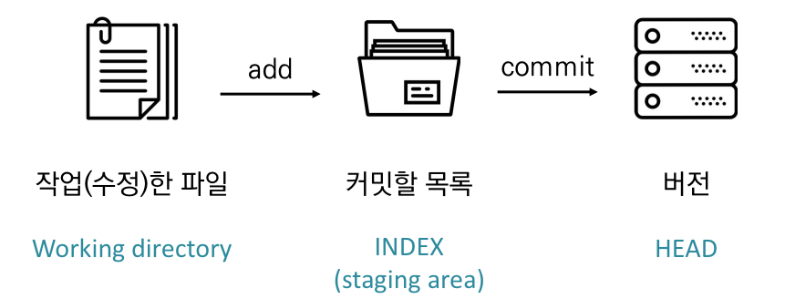
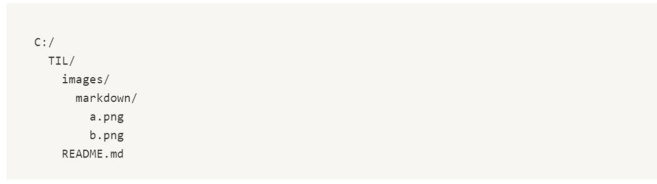

# git 

## 기본흐름

1. 작업
2. add하여 Staging area에 모음
3. commit으로 버전 기록




### 상태

- modified : 파일이 수정된 상태 (add 명령어로 staging area로)
- staged : 수정한 파일을 곧 커밋할 것이라 표시(commit 명령어로 저장소로)
- commiteed : 커밋 된 상태


## 파일 라이프 사이클 

- Working directory의 모든 파일은 특정 상태를 가지며, git 명령어를 통해 변경
  - Tracked : 이전부터 버전으로 관리되고 있는 파일
    - Unmodified : git status에 나타나지 않음
    - Modified : Changes not staged for commit
    - Staged : Changes to be committed
  - Untracked : 버전으로 관리된 적 없는 파일 (파일을 새로 만든 경우)


## 기본 명령어

### init

```bas
$ git init
```

- 특정 폴더를 git 저장소(repository)를 만들어 git으로 관리
  - .git 폴더가 생성
  - git bash에서는 (master)라는 표기를 확인할 수 있음


### add

```bas
$ git add <file>
```

- working directory상의 변경 내용을 staging area에 추가하기 위해 사용
  - untracked 상태의 파일을 staged로 변경
  - modified 상태의 파일을 staged로 변경


### commit

```bas
$ git commit –m ‘<커밋메시지>’
```

- staged 상태의 파일들을 커밋을 통해 버전으로 기록
- SHA-1 해시를 사용하여 40자 길이의 체크섬을 생성하고, 이를 통해 고유한 커밋을 표기
- 커밋 메시지는 변경 사항을 나타낼 수 있도록 명확하게 작성해야 함
- Git은 데이터를 파일 시스템의 스냅샷으로 관리하고 매우 크기가 작음
- 파일이 달라지지 않으면 성능을 위해 파일을 새로 저장하지 않음
- 기존의 델타 기반 버전 관리시스템과 가장 큰 차이를 가짐


### status

```bas
$ git status
```

- Git 저장소에 있는 파일의 상태를 확인하기 위하여 활용
  - 파일의 상태를 알 수 있음
    - Untracked files
    - Changes not staged for commit
    - Changes to be committed
  - Noting to commit, working tree clean


### log

```bas
$ git log
```

- 현재 저장소에 기록된 커밋을 조회
- 다양한 옵션을 통해 로그를 조회할 수 있음

```bash
$ git log -1
$ git log -oneline
$ git log -2 --oneline
```


## Git 설정 파일 (config)

- 사용자 정보 (commit author) : 커밋을 하기 위해 반드시 필요
  - git config —global user.name “username”
    - Github에서 설정한 username으로 설정
  - git config —global user.email “my@email.com”
    - Github에서 설정한 email로 설정
- 설정 확인
  - git config -l
  - git config —global -l
  - git config user.name
- —system
  - /etc/gitconfig
  - 시스템의 모든 사용자와 모든 저장소에 적용(관리자 권한)
- —global
  - ~/.gitconfig
  - 현재 사용자에게 적용되는 설정
- —local
  - .git/config
  - 특정 저장소에만 적용되는 설정


## 디렉토리에 대한 이해

- CLI에서 현재 폴더의 목록
  - . : 현재 디렉토리
    - 그래서 git add . 이 현재 폴더에 대한 모든 파일의 변경사항을 add 하는 것!
  - .. : 상위 디렉토리


- README.md에서 b.png를 활용하기 위해서는?
  - 절대 경로 : C:/TIL/images/markdown/b.png
  - 상대 경로 : ./images/markdown/b.png
  - 

- style.css에서 a.png를 활용하기 위해서는?
  - style.css 위치는 my_web의 css!
  - 즉, 상대 경로로 표현하면 ../images/a.png
  - 

## 원격저장소 활용

- 분산버전관리시스템(DVCS)
  - 중앙집중식버전관리시스템은 중앙에서 버전을 관리하고 파일을 받아서 사용
  - 분산버전관리시스템은 원격 저장소(remote repository)를 통하여 협업하고,
    모든 히스토리를 클라이언트들이 공유
  - 

- 원격저장소 설정 명령어

  - ```bash
    # remote 확인
    $ git remote -v
    ```

  - ```ba
    # remote 추가
    $ git remote add <이름> <url>
    ```

  - ```ba
    # remote 삭제
    $ git remote rm <이름>
    ```

  - ```ba
    # remote url 변경
    $ git remote set-url <이름> <url>
    ```

  - ```bash
    # remote 이름 변경
    $ git remote rename <이름> <새이름>
    ```

  - ```bash
    # 원격 저장소 추가
    $ git remote add origin <주소>
    ```

    - 깃아 원격저장소 ``remote`` 를 추가해줘(``add``),``origin``으로, 주소를

- 원격저장소 활용 명령어

  - ```bash
    # 원격 저장소를 복제하여 가져옴
    $ git clone <원격저장소주소>
    ```

  - ```bash
    # 원격 저장소로 로컬 저장소 변경 사항(커밋)을 올림(push)
    # 로컬 폴더의 파일/폴더가 아닌 저장소의 버전(커밋)이 올라감
    $ git push <원격저장소이름> <브랜치이름>
    ```

    - ``-u`` : upstream option
      - ```git push``` 라고 명령을 하더라도 설정된 원격저장소에 브랜치를 push
      - ```git push -u origin master```

  - ```bash
    # 원격 저장소로부터 변경된 내역을 받아와서 이력을 병합함
    $ git pull <원격저장소이름> <브랜치이름>
    ```

- 원격저장소 조회

  - ```bash
    $ git remote -v # verbose
    origin  https://github.com/ID/test.git (fetch)
    origin  https://github.com/ID/test.git (push)
    ```